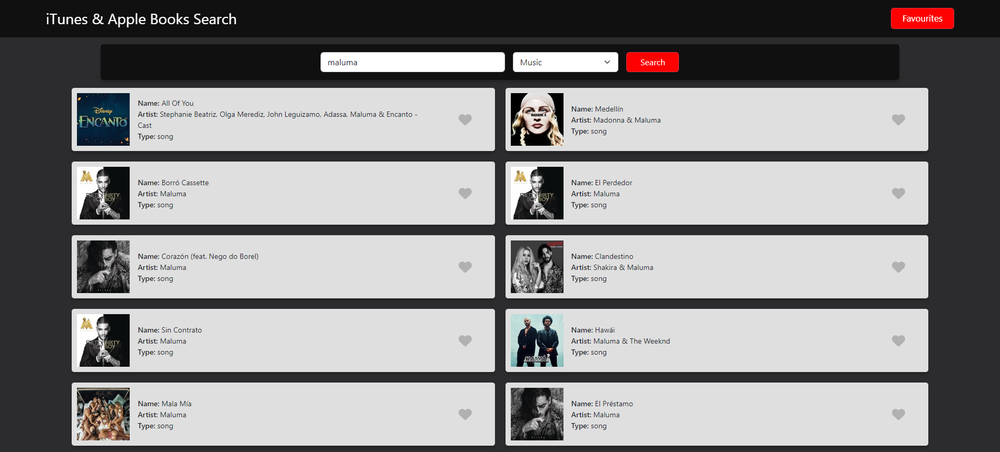
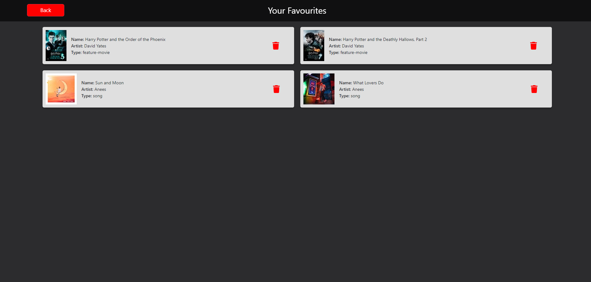
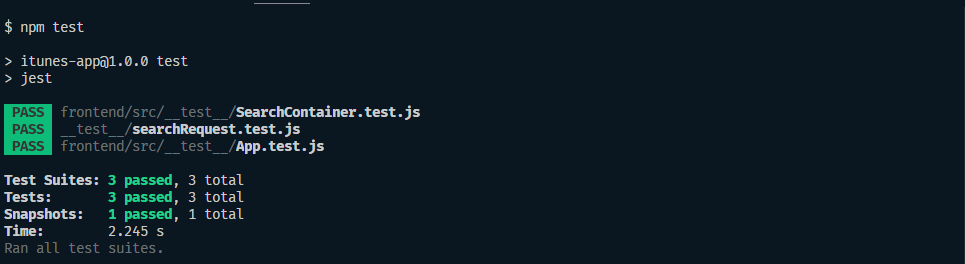

# ITunes App

## Description

The iTunes App is a web application that allows users to search for media such as movies, podcasts, music, music videos, audio books, short films, TV shows, software, and ebooks. Users can also add items to their favorites list and remove them from the list. The application is built using React, Node.js, and Express that interfaces with the iTunes Search API.

## Table of Contents

<ul>
<li><a href="#how-to-use-the-app">How to use the App</a></li>
<li><a href="#demo">Demo</a></li>
<li><a href="#installing">Installation</a></li>
<li><a href="#security">Security</a></li>
<li><a href="#technologies">Technologies</a></li>
</ul>

# How to use the app

### To search:

1. Enter a search term within the search box
2. Select the type of media you would like to search for, i.e. movie, podcast, music, music video, audio book, short film, TV show, software, ebook or all from the drop-down menu
3. Press 'Search'

### To add to favourites:

1. Find the item you would like to add to favourites
2. Click the heart icon next to that item to add it

### To view favourites:

1. Click the 'Favourites' button which will take you to your list of favourites

### To remove an item within favourites:

1. Click the red trash icon next to the item you would like to remove

### To remove an item from favourites from home page:

1. Find the item with a red heart icon next to it that you would like to remove from favourites
2. Click the heart icon to unselect it and it will be removed

# Demo

View the live demo [here](https://itunes-app-27.herokuapp.com/)

# Installing, testing and running the code

# Installing

1. Open the command prompt/terminal and navigate to the backend folder
2. Run `npm start`
3. Open another command prompt/terminal without closing the other one and navigate to the frontend folder
4. Run `npm start`
5. Open [http://localhost:3000](http://localhost:3000) to view the application in your browser

# Testing

#### To test the backend & frontend:

1. Open the command prompt/terminal and navigate to the itunes => (backend) folder
2. Run `npm start` to start the server
3. Open another command prompt/terminal without closing the other one and navigate to the backend folder
4. Run `npm test` to run the backend test(s), you'll see that automatically jest will test both, backend and front at the same time

# Running the code

1. Open the command prompt/terminal and navigate to the backend folder
2. Run `npm start`
3. Open [http://localhost:3030](http://localhost:3030) to view the application in your browser

# Security

This application has been secured using [Helmet](https://helmetjs.github.io/) and no API keys were needed to use the iTunes Search API, therefore this application does not contain an .env file.

# Technologies

This project uses the following technologies:

<ul>
<li>HTML</li>
<li>CSS</li>
<li>React</li>
<li>Node.js</li>
<li>Express</li>
<li>React-Bootstrap</li>
</ul>
